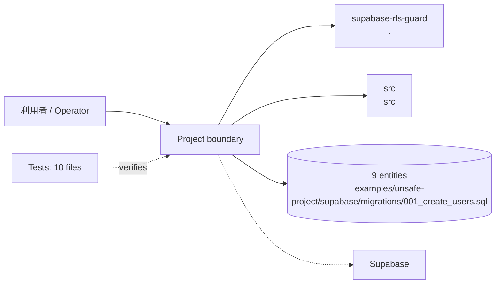
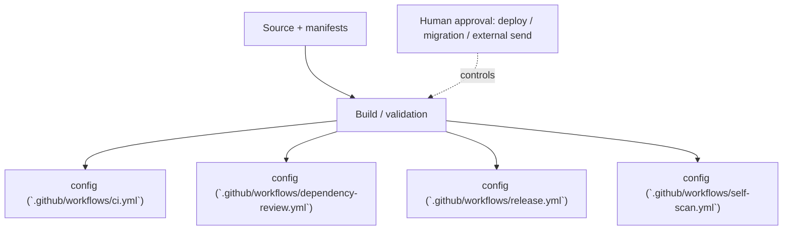

<!-- generated-by: scripts/generate_engineering_docs.py -->
# Supabase RLS Guard — アーキテクチャ・システム構成

> 生成日: 2026-07-15 / 対象: `supabase-rls-guard` / 確度: [高]
> 実装・manifest・既存資料の静的棚卸しに基づく。外部サービスの稼働状態と本番構成は未検証。

## 論理アーキテクチャ

## 配備・実行構成

## コンポーネント責務

| Component | Path | 責務 |
|---|---|---|
| `supabase-rls-guard` | `.` | 責務は実装と既存READMEを確認 |
| `src` | `src` | 中核実装。詳細は配下moduleを参照 |

### 検出したruntime / service

- `config (`.github/workflows/ci.yml`)`
- `config (`.github/workflows/dependency-review.yml`)`
- `config (`.github/workflows/release.yml`)`
- `config (`.github/workflows/self-scan.yml`)`

## 実装境界

- UI/入口: UI route未検出
- API: API route未検出
- Data: `examples/unsafe-project/supabase/migrations/001_create_users.sql`, `examples/unsafe-project/supabase/migrations/002_create_todos.sql`, `examples/unsafe-project/supabase/migrations/010_settings.sql`, `examples/unsafe-project/supabase/migrations/009_grants.sql`, `examples/unsafe-project/supabase/migrations/005_profiles.sql`, `examples/unsafe-project/supabase/migrations/011_legacy.sql`, `examples/unsafe-project/supabase/migrations/004_posts.sql`, `examples/unsafe-project/supabase/migrations/006_api_keys.sql`, `examples/unsafe-project/supabase/migrations/007_admin_flags.sql`, `examples/safe-project/supabase/migrations/001_profiles.sql`
- External: Supabase

## セキュリティ境界

- 認証・回復性の実装シグナル: auth/session (`tests/rules.test.ts`), tenant/RLS (`tests/rules.test.ts`), tenant/RLS (`tests/parser.test.ts`), tenant/RLS (`tests/suppressions.test.ts`), tenant/RLS (`tests/fold.test.ts`), tenant/RLS (`tests/service-docs.test.ts`), auth/session (`tests/scan.test.ts`), tenant/RLS (`tests/scan.test.ts`), tenant/RLS (`tests/cli.test.ts`), tenant/RLS (`examples/unsafe-project/supabase/migrations/001_create_users.sql`), tenant/RLS (`examples/unsafe-project/supabase/migrations/008_views_functions.sql`), tenant/RLS (`examples/unsafe-project/supabase/migrations/002_create_todos.sql`)
- 設定名: example/sourceから未検出（値は収集していない）
- deploy、migration、外部送信、課金はHuman Approval Gate対象。
