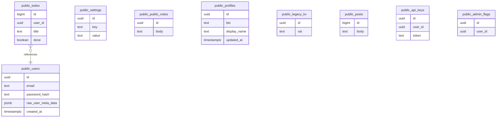

<!-- generated-by: scripts/generate_engineering_docs.py -->
# Supabase RLS Guard — データモデル・ER図

> 生成日: 2026-07-15 / 対象: `supabase-rls-guard` / 確度: [高]
> 実装・manifest・既存資料の静的棚卸しに基づく。外部サービスの稼働状態と本番構成は未検証。

## ER / データフロー

> [中] entity名はschema/migrationから直接検出。属性・関係は誤推測を避けるため、正典schemaで確認できないものを補完していない。

## Entity台帳

| Entity | 検出field | 根拠 | 未確認事項 |
|---|---|---|---|
| `public.users` | `id: uuid`, `email: text`, `password_hash: text`, `raw_user_meta_data: jsonb`, `created_at: timestamptz` | `examples/unsafe-project/supabase/migrations/001_create_users.sql` | constraint/retention確認 |
| `public.todos` | `id: bigint`, `user_id: uuid`, `title: text`, `done: boolean` | `examples/unsafe-project/supabase/migrations/002_create_todos.sql` | constraint/retention確認 |
| `public.settings` | `id: uuid`, `key: text`, `value: text` | `examples/unsafe-project/supabase/migrations/010_settings.sql` | constraint/retention確認 |
| `public.public_notes` | `id: uuid`, `body: text` | `examples/unsafe-project/supabase/migrations/009_grants.sql` | constraint/retention確認 |
| `public.profiles` | `id: uuid`, `bio: text`, `display_name: text`, `updated_at: timestamptz` | `examples/unsafe-project/supabase/migrations/005_profiles.sql`, `examples/safe-project/supabase/migrations/001_profiles.sql` | constraint/retention確認 |
| `public.legacy_kv` | `id: uuid`, `val: text` | `examples/unsafe-project/supabase/migrations/011_legacy.sql` | constraint/retention確認 |
| `public.posts` | `id: bigint`, `body: text` | `examples/unsafe-project/supabase/migrations/004_posts.sql` | constraint/retention確認 |
| `public.api_keys` | `id: uuid`, `user_id: uuid`, `token: text` | `examples/unsafe-project/supabase/migrations/006_api_keys.sql` | constraint/retention確認 |
| `public.admin_flags` | `id: uuid`, `user_id: uuid` | `examples/unsafe-project/supabase/migrations/007_admin_flags.sql` | constraint/retention確認 |

## Relation台帳

- `public.todos` → `public.users` (`examples/unsafe-project/supabase/migrations/002_create_todos.sql`)
- `public.profiles` → `auth.users` (`examples/safe-project/supabase/migrations/001_profiles.sql`)

## 変更時の実務チェック

- schema/migration正典: `examples/unsafe-project/supabase/migrations/001_create_users.sql`, `examples/unsafe-project/supabase/migrations/002_create_todos.sql`, `examples/unsafe-project/supabase/migrations/010_settings.sql`, `examples/unsafe-project/supabase/migrations/009_grants.sql`, `examples/unsafe-project/supabase/migrations/005_profiles.sql`, `examples/unsafe-project/supabase/migrations/011_legacy.sql`, `examples/unsafe-project/supabase/migrations/004_posts.sql`, `examples/unsafe-project/supabase/migrations/006_api_keys.sql`, `examples/unsafe-project/supabase/migrations/007_admin_flags.sql`, `examples/safe-project/supabase/migrations/001_profiles.sql`, `examples/unsafe-project/supabase/migrations/008_views_functions.sql`, `examples/unsafe-project/supabase/migrations/003_enable_todos_rls.sql`, `examples/safe-project/supabase/migrations/002_profiles_policies.sql`, `examples/safe-project/supabase/migrations/003_function.sql`
- API影響: APIとの結線を検索
- tenant/user境界、主キー、一意制約、外部キー、削除方式、seed/fixtureをmigrationと照合する。
- migration/apply前にbackup、forward/backward compatibility、rollback可否をレビューする。
