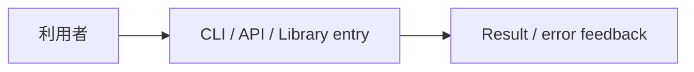

<!-- generated-by: scripts/generate_engineering_docs.py -->
# Supabase RLS Guard — 画面設計書

> 生成日: 2026-07-15 / 対象: `supabase-rls-guard` / 確度: [高]
> 実装・manifest・既存資料の静的棚卸しに基づく。外部サービスの稼働状態と本番構成は未検証。

## 画面・入口一覧

| Route / Screen | Component | 目的（pathから推定） | 実装interaction | 必須状態 | 実装根拠 |
|---|---|---|---|---|---|
| UI route未検出 | - | CLI/library/backend/docs-only | - | help/error/resultを確認 | - |

## 基本導線

## 変更時の実務チェック

- API候補: 画面からのdata境界を検索
- schema候補: `examples/unsafe-project/supabase/migrations/001_create_users.sql`, `examples/unsafe-project/supabase/migrations/002_create_todos.sql`, `examples/unsafe-project/supabase/migrations/010_settings.sql`, `examples/unsafe-project/supabase/migrations/009_grants.sql`, `examples/unsafe-project/supabase/migrations/005_profiles.sql`, `examples/unsafe-project/supabase/migrations/011_legacy.sql`, `examples/unsafe-project/supabase/migrations/004_posts.sql`, `examples/unsafe-project/supabase/migrations/006_api_keys.sql`
- 認証/認可、loading、empty、validation、依存障害、permission状態を実装とtestで確認する。
- responsive/accessibilityの対象viewportと操作方法はproject固有の利用者・platformに合わせる。
